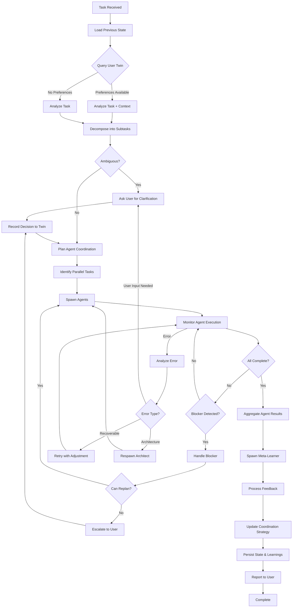
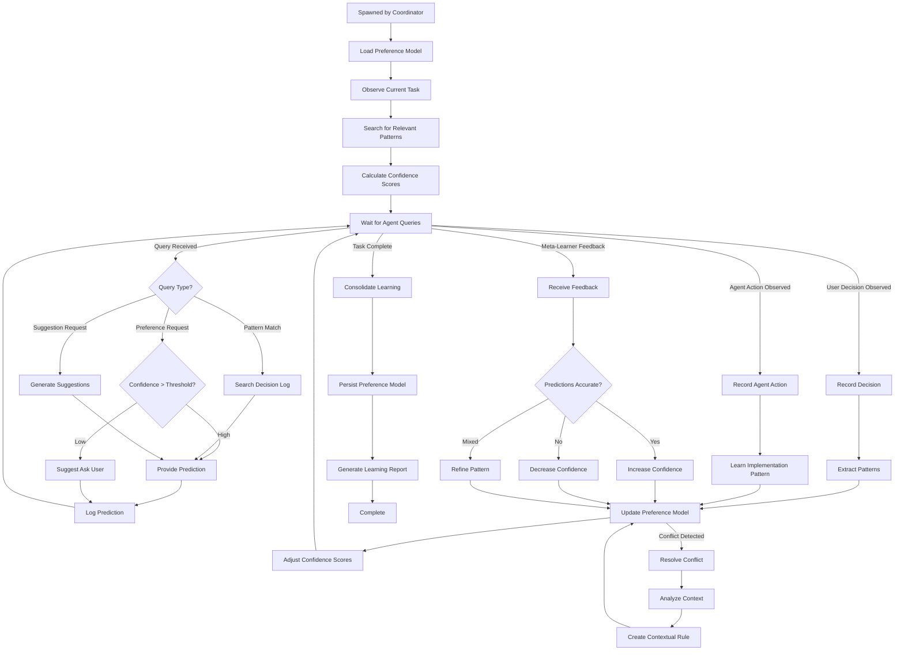
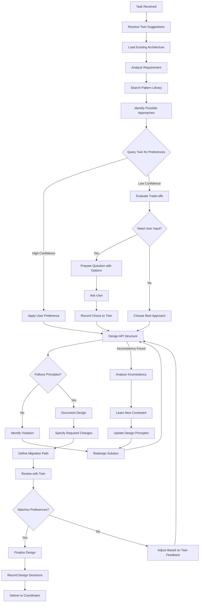
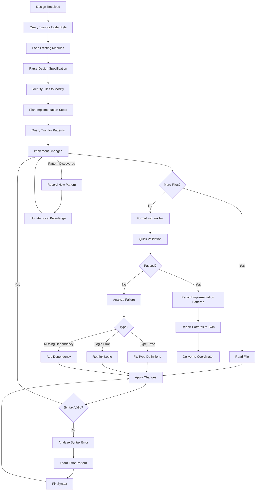
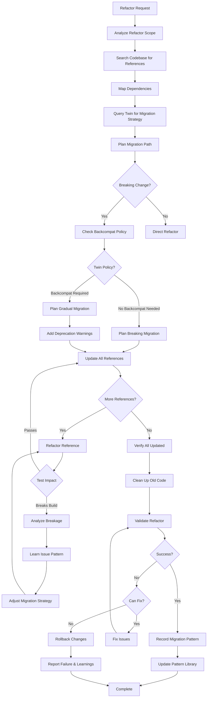
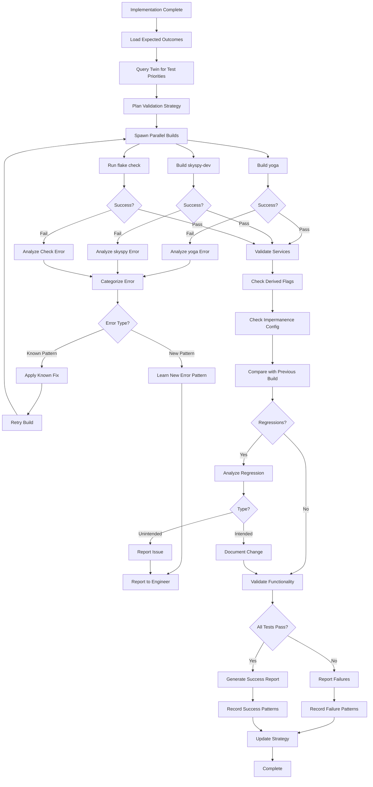
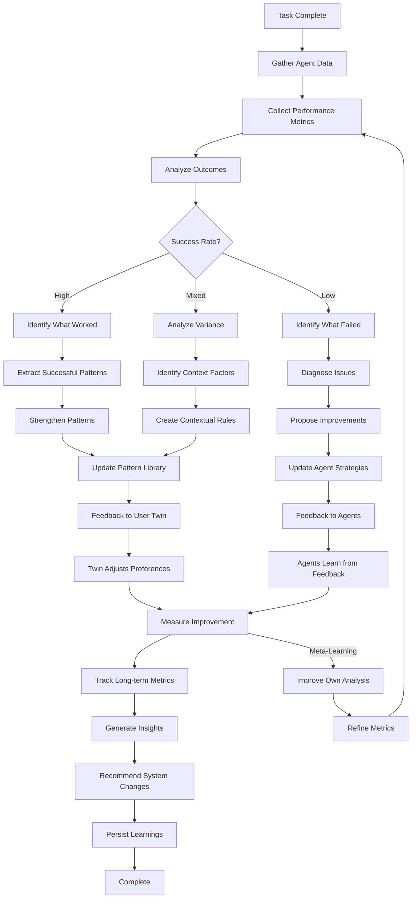
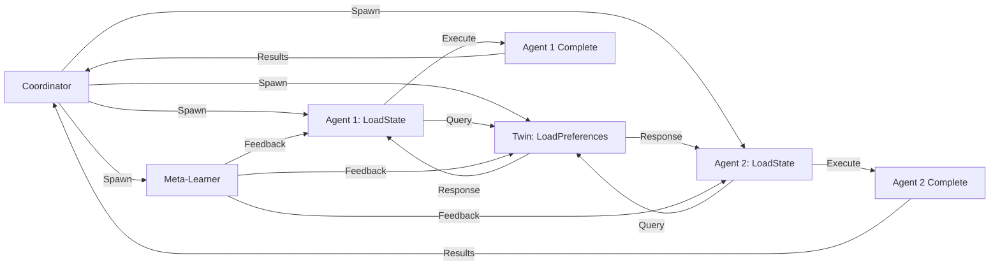

# Cybernetic Workflows for mynixos Agents

## Overview

Each agent in the mynixos system operates as a **cybernetic learning system** with:
- **Input Processing**: Receive and parse tasks
- **Execution Workflow**: Follow defined steps with state management
- **Error Learning**: Understand failures and adapt
- **Feedback Loops**: Backward propagation from outcomes
- **Forward Loops**: Anticipatory behavior based on patterns
- **State Persistence**: Track progress and learning across sessions

---

## 1. mynixos-orchestrator (Coordinator)

### Purpose
Command & control center for multi-agent task coordination and dynamic agent spawning.

### Cybernetic Workflow



### Feedback Loops

**Loop 1: Agent Performance**
```
Agent Execution → Success/Failure → Record Outcome → Adjust Agent Selection → Better Future Coordination
```

**Loop 2: User Interaction**
```
User Question → User Answer → Twin Records → Fewer Future Questions → Better UX
```

**Loop 3: Error Recovery**
```
Error Detected → Analyze Root Cause → Update Error Handling → Prevent Future Occurrence
```

### Forward Loops

**Anticipatory Planning**:
- Predict which agents will be needed before full analysis
- Pre-load preferences from twin while analyzing
- Spawn independent agents early (parallel)

**Proactive Blockers**:
- Identify potential blockers before they occur
- Pre-emptively gather information
- Start backup strategies in parallel

### Error Learning

**Error Categories**:
1. **Task Ambiguity**: Learn which task types need user clarification
2. **Agent Failure**: Learn which agents struggle with which tasks
3. **Coordination Issues**: Learn optimal spawn order and parallelization
4. **User Escalations**: Learn what should have been predicted

**Learning Actions**:
- Update agent selection heuristics
- Adjust parallelization strategies
- Improve task decomposition patterns
- Refine user question templates

### State Management

```json
{
  "task_id": "uuid",
  "status": "monitoring_agents",
  "agents_spawned": ["architect", "user-twin", "engineer"],
  "agents_complete": ["architect", "user-twin"],
  "blockers": [],
  "decisions_made": [...],
  "start_time": "...",
  "estimated_completion": "..."
}
```

---

## 2. mynixos-user-twin

### Purpose
Learns user preferences and proactively guides other agents to reduce friction.

### Cybernetic Workflow



### Feedback Loops

**Loop 1: Prediction Accuracy**
```
Predict → Agent/User Acts → Compare Outcome → Adjust Confidence → Better Predictions
```

**Loop 2: Pattern Recognition**
```
Observe Decision → Extract Pattern → Generalize → Test Prediction → Validate → Strengthen Pattern
```

**Loop 3: Cross-Agent Learning**
```
Observe Architect Design → Learn Pattern → Suggest to Engineer → Validate Implementation → Refine Understanding
```

### Forward Loops

**Proactive Suggestions**:
- Predict likely questions before architect asks
- Suggest patterns before engineer implements
- Anticipate user preferences on new features

**Trend Analysis**:
- Detect shifts in user preferences over time
- Predict future needs based on past trajectory
- Suggest proactive improvements

### Error Learning

**Error Categories**:
1. **Wrong Prediction**: Learn why prediction was incorrect
2. **Context Missed**: Learn contextual factors that change preferences
3. **Confidence Miscalibration**: Learn when to be more/less confident
4. **Pattern Overgeneralization**: Learn edge cases

**Learning Actions**:
- Add contextual conditions to patterns
- Split overgeneralized patterns into specific cases
- Adjust confidence thresholds
- Request clarification on edge cases

### State Management

```json
{
  "session_id": "uuid",
  "preferences_loaded": true,
  "predictions_made": 5,
  "predictions_validated": 3,
  "accuracy_rate": 0.6,
  "patterns_learned_this_session": 2,
  "confidence_adjustments": [...],
  "pending_validations": [...]
}
```

---

## 3. mynixos-architect

### Purpose
Designs API structure, namespaces, and architectural patterns.

### Cybernetic Workflow



### Feedback Loops

**Loop 1: Design Validation**
```
Design → Engineer Implements → Validator Tests → Issues Found → Learn Constraint → Better Designs
```

**Loop 2: User Preference**
```
Design with Options → User Chooses → Twin Records → Future Designs Match → Less Questions
```

**Loop 3: Pattern Effectiveness**
```
Apply Pattern → Meta-Learner Analyzes → Pattern Successful/Failed → Adjust Pattern Library → Better Patterns
```

### Forward Loops

**Anticipatory Design**:
- Predict future extensibility needs
- Design for likely evolution paths
- Consider migration before it's needed

**Constraint Prediction**:
- Learn which designs cause implementation issues
- Avoid patterns that led to problems
- Suggest preventive design choices

### Error Learning

**Error Categories**:
1. **Implementation Difficulty**: Design was hard to implement
2. **Migration Complexity**: Breaking changes caused issues
3. **Principle Violation**: Design didn't follow user preferences
4. **Incomplete Specification**: Engineer needed clarification

**Learning Actions**:
- Add implementation feasibility checks
- Simplify complex migrations
- Strengthen principle adherence
- Improve specification detail

---

## 4. mynixos-engineer

### Purpose
Implements features, fixes bugs, writes Nix modules.

### Cybernetic Workflow



### Feedback Loops

**Loop 1: Build Validation**
```
Implement → Build Fails → Analyze Error → Learn Fix Pattern → Prevent Future Errors
```

**Loop 2: Code Style**
```
Write Code → Twin Reviews Style → Adjust → Twin Records Preference → Future Code Matches
```

**Loop 3: Pattern Reuse**
```
Implement Pattern → Works Well → Record Pattern → Reuse in Similar Cases → Faster Implementation
```

### Forward Loops

**Predictive Implementation**:
- Predict likely errors before building
- Pre-emptively add dependencies
- Anticipate type issues

**Pattern Recognition**:
- Recognize similar implementations
- Reuse successful patterns
- Avoid known problem patterns

### Error Learning

**Error Categories**:
1. **Syntax Errors**: Learn Nix syntax edge cases
2. **Type Errors**: Learn type system constraints
3. **Build Failures**: Learn build-time requirements
4. **Runtime Errors**: Learn runtime assumptions

**Learning Actions**:
- Build syntax checking patterns
- Create type compatibility rules
- Document dependency requirements
- Test assumptions before implementing

---

## 5. mynixos-refactorer

### Purpose
Migrates code, handles deprecations, improves architecture while maintaining compatibility.

### Cybernetic Workflow



### Feedback Loops

**Loop 1: Migration Success**
```
Migrate → Test → Failure Found → Learn Edge Case → Update Strategy → Successful Migrations
```

**Loop 2: Breaking Change Impact**
```
Breaking Change → User Impact → Twin Records Tolerance → Calibrate Future Decisions
```

**Loop 3: Pattern Effectiveness**
```
Apply Migration Pattern → Measure Success → Record Effectiveness → Use Better Patterns
```

### Forward Loops

**Predictive Analysis**:
- Predict which references will be hard to migrate
- Anticipate breaking change impact
- Prepare rollback strategy in advance

**Risk Assessment**:
- Learn which types of refactors are risky
- Predict build failures before running
- Suggest lower-risk alternatives

### Error Learning

**Error Categories**:
1. **Incomplete Migration**: Missed references
2. **Breaking Downstream**: Unexpected dependencies
3. **Rollback Failure**: Can't recover
4. **Test Gaps**: Missed validation

**Learning Actions**:
- Improve reference detection
- Better dependency mapping
- Safer rollback strategies
- Comprehensive validation

---

## 6. mynixos-validator

### Purpose
Validates builds, tests configurations, ensures no regressions.

### Cybernetic Workflow



### Feedback Loops

**Loop 1: Error Pattern Recognition**
```
Build Fails → Categorize Error → Apply Fix → Success → Record Pattern → Faster Future Fixes
```

**Loop 2: Regression Detection**
```
Detect Regression → Analyze Cause → Prevent Recurrence → Better Validation
```

**Loop 3: Test Effectiveness**
```
Run Tests → Measure Coverage → Identify Gaps → Add Tests → Better Validation
```

### Forward Loops

**Predictive Testing**:
- Predict likely failure points
- Run high-risk tests first
- Prepare recovery strategies

**Proactive Validation**:
- Validate before full build
- Quick syntax checks first
- Incremental validation

### Error Learning

**Error Categories**:
1. **Build Errors**: Compilation/evaluation failures
2. **Type Errors**: Type system violations
3. **Runtime Errors**: Service startup failures
4. **Regressions**: Unintended changes

**Learning Actions**:
- Build error pattern library
- Create type checking rules
- Service validation scripts
- Regression test suites

---

## 7. mynixos-meta-learner

### Purpose
Facilitates agent learning, feedback loops, and self-improvement.

### Cybernetic Workflow



### Feedback Loops

**Loop 1: Pattern Validation**
```
Agents Use Pattern → Measure Success → Validate Pattern → Strengthen/Weaken → Better Patterns
```

**Loop 2: Agent Performance**
```
Analyze Agent → Identify Weakness → Provide Feedback → Agent Improves → Measure Improvement
```

**Loop 3: System Evolution**
```
System Behavior → Meta-Analysis → Recommendations → System Changes → Better System
```

### Forward Loops

**Trend Analysis**:
- Predict system performance trends
- Anticipate learning plateaus
- Suggest proactive improvements

**Capability Forecasting**:
- Project future agent capabilities
- Predict when human intervention won't be needed
- Identify next learning frontiers

### Error Learning

**Error Categories**:
1. **Analysis Blind Spots**: Missed important patterns
2. **Metric Inadequacy**: Metrics don't capture reality
3. **Feedback Ineffective**: Agents don't improve from feedback
4. **Pattern Overfitting**: Patterns too specific

**Learning Actions**:
- Expand analysis dimensions
- Design better metrics
- Improve feedback mechanisms
- Balance pattern specificity

---

## Execution Through Workflows

### State Tracking

Each agent maintains workflow state:
```json
{
  "workflow_stage": "ImplementChanges",
  "entry_time": "2025-12-06T...",
  "previous_stage": "QueryTwin",
  "next_stage": "VerifySyntax",
  "loop_iterations": 2,
  "errors_encountered": [],
  "learnings_this_execution": []
}
```

### Workflow Enforcement

Agents MUST:
1. **Follow their defined workflow** - no shortcuts
2. **Record state transitions** - track progress
3. **Learn from errors** - update knowledge at error nodes
4. **Execute feedback loops** - complete backward propagation
5. **Run forward loops** - apply learned patterns
6. **Persist learnings** - save state for next execution

### Parallel Execution Coordination



### Learning Persistence

After each workflow execution:
1. **Append to decision log**: `.claude/learning/decision-log.jsonl`
2. **Update pattern library**: `.claude/learning/pattern-library.md`
3. **Update agent knowledge**: `.claude/agents/<agent>-knowledge.json`
4. **Update twin preferences**: `.claude/learning/user-preferences.json`

---

## Success Criteria

A cybernetic agent system is successful when:

1. **Agents learn from errors** - same error doesn't repeat
2. **Feedback loops function** - improvements observed over time
3. **Forward loops activate** - agents anticipate and prevent issues
4. **Parallel execution works** - agents coordinate without blocking
5. **State persists** - learnings survive across sessions
6. **System evolves** - capabilities increase over time
7. **Human intervention decreases** - system becomes more autonomous
